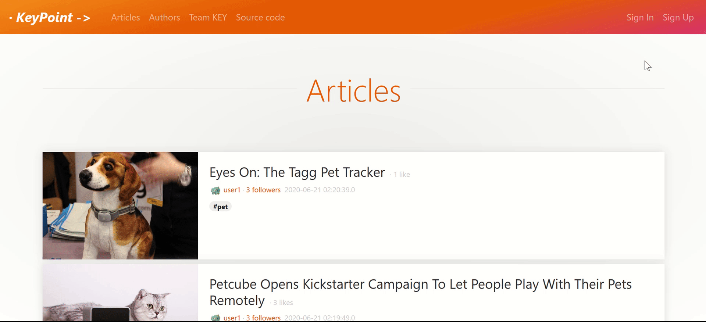
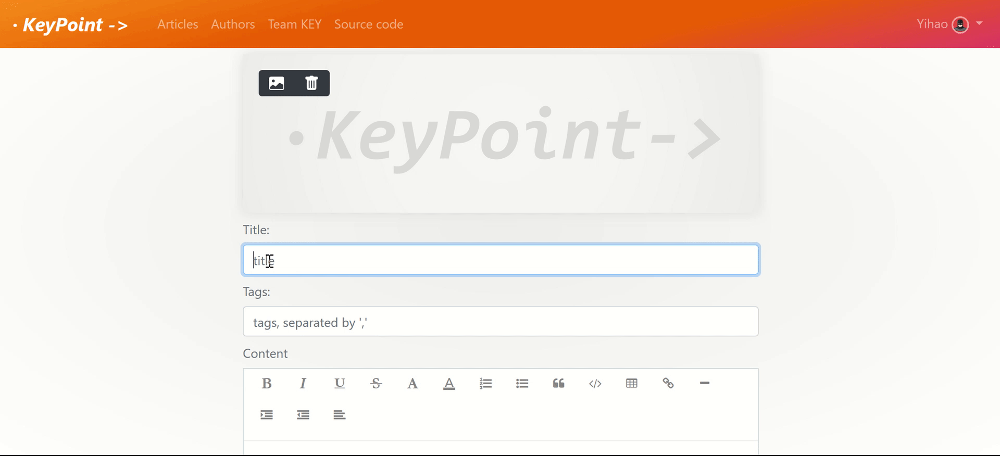

# KeyPoint

## Introduction
- [KeyPoint](https://trex-sandwich.com/taz_KeyPoint/) is a blog website, where you can share your points with others by posting articles. This website supports account creation and management, commenting on articles and on other comments, liking articles and following authors, attaching tags to articles and browsing articles by tags, and more. This project is currently deployed on https://trex-sandwich.com/taz_KeyPoint/ . It is the final project for the PGCIT program of University of Auckland. My co-authors are Kalvin Wei and Esther Zhang.

## Tech Stack
  - **Database**: MariaDB
  - **Backend**: java - Servlets, DAO, JSP
  - **Frontend**: Bootstrap, jQuery, AJAX (HTML, CSS, JavaScript)

## Features
  - Browse and read articles

    

  - Read or hide comments

    

  - View all articles by an author

    

  - Personal blog page

    

  - Account creation

    

    

  - Edit personal profile

    

  - Select or upload avatars

    

  - Create posts

    

  - Attach cover images to your posts

    

  - 'What you see is what you get' editor

    

  - Make comments

    

  - Delete comments

    

  - Delete articles

    

  - Delete account

    

  - Filter articles by tags

    

  - Like articles

    

  - Browse the articles that you have liked

    

  - Follow authors

    

  - Browse your followers and authors you have followed

    

  - Responsiveness on mobile devices

    

  - Prevention against XSS
  
    

  
#### Notes on Deployment
- Run run `/scripts/initSchema.sql` first to initialize the database